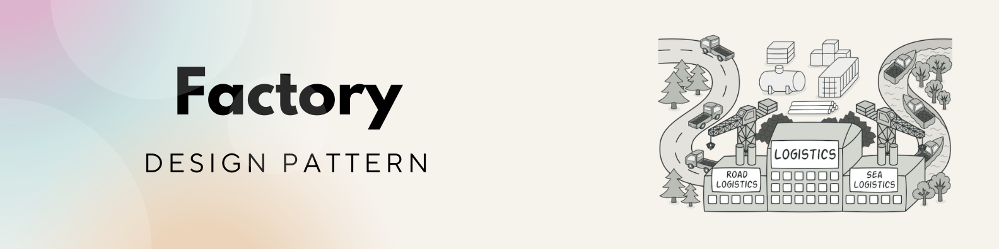
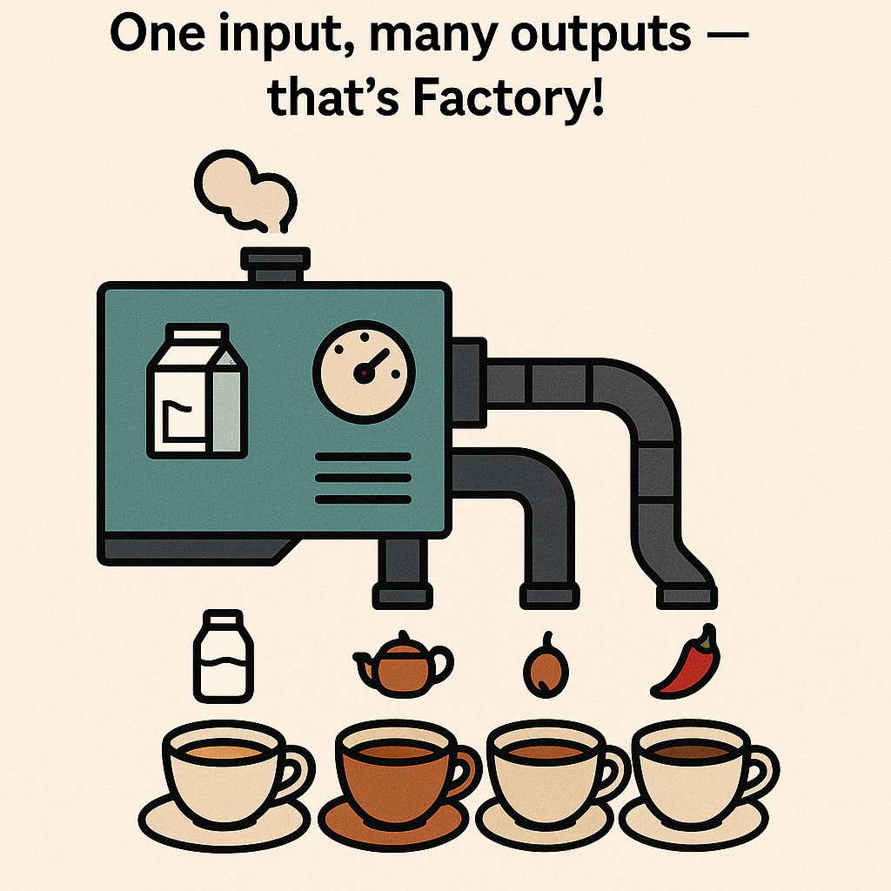

## Factory Pattern - নিজের জন্য বানাও, কিন্তু Choice সহ!

**আমরা সবাই চা খাই, কিন্তু কেউ লাল চা, কেউ দুধ চা, কেউ আবার মালাই চা — Factory Pattern বলছে, চিন্তা নাই ভাই, যার যেটা পছন্দ, সেটাই বানিয়ে দিচ্ছি!** 

---

### Factory Pattern মানে কী?

Factory Pattern এমন একটা design pattern, যেখানে **object বানানোর জন্য একটা common method থাকে** , আর এই method-টা সিদ্ধান্ত নেয়, কাকে বানাবে।

> মানে আপনি বলবেন: "আমাকে একটা চা দাও",
> আর Factory বলবে: "ঠিক আছে, তুমি লাল চা চাও, না দুধ চা?"
> তারপর রেসিপি অনুযায়ী বানিয়ে দেবে! 



---

### কোডে দেখা যাক (JavaScript example):

```js
// Step 1: চা গুলো define করি
class MilkTea {
  info() {
    return "দুধ চা প্রস্তুত!";
  }
}

class BlackTea {
  info() {
    return "লাল চা প্রস্তুত!";
  }
}

class MasalaTea {
  info() {
    return "মসলা চা প্রস্তুত!";
  }
}

// Step 2: Factory method তৈরি করি
class TeaFactory {
  static createTea(type) {
    switch (type) {
      case "milk":
        return new MilkTea();
      case "black":
        return new BlackTea();
      case "masala":
        return new MasalaTea();
      default:
        throw new Error("এই রকম চা আমাদের মেনুতে নাই ভাই!");
    }
  }
}

// Step 3: Order নেওয়া শুরু
const myTea = TeaFactory.createTea("milk");
console.log(myTea.info()); // দুধ চা প্রস্তুত!
```

---

### এখানে কী হলো?

* আমরা চায়ের **অভিন্ন অর্ডার মেশিন (Factory)** বানালাম।
* Factory জানে, কে কী চা চায় — তার type দেখে কাস্টম চা বানিয়ে দিচ্ছে!
* এতে করে নতুন Tea type যোগ করাও সহজ হয়, এবং কোড clean থাকে।

---

### কখন ব্যবহার করবেন?

* যখন অনেকগুলা class আছে যেগুলো একই টাইপের জিনিস বানায় (Product family)।
* যখন চাই client যেন constructor জানার দরকার না পড়ে, শুধু বলুক type।

#### Use cases:

* Notification services (SMS, Email, Push)
* Shape generator (Circle, Square, Triangle)
* UI components (Button, Modal, Tooltip)
* Even burger builders!

---

### মজার উদাহরণ:

> একটা Tea Stall-এর মতো চিন্তা করুন —
> আপনি বললেন “একটা চা দেন ভাই”,
> Factory বলল “কি চা?”
> আপনি বললেন “দুধ চা”
> সে বলল “নিন ভাই, আপনার দুধ চা”

> Factory = দোকানদার

---

### 📌 TL;DR

* **Factory Pattern** object বানায় type অনুযায়ী।
* New object বানানোর logic থাকে Factory method-এর ভিতরে।
* Client শুধু বলে, “আমাকে এটা চাই” — বাকিটা Factory বুঝে নেয়!
