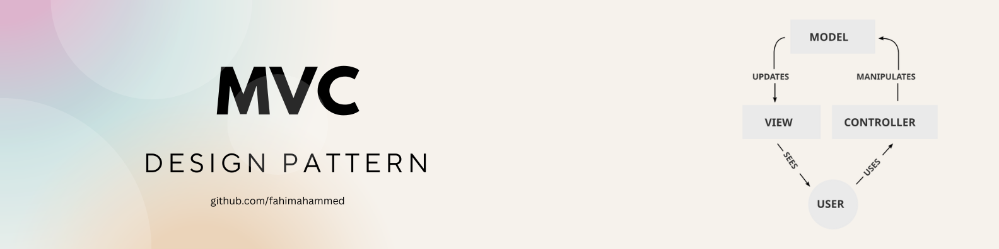
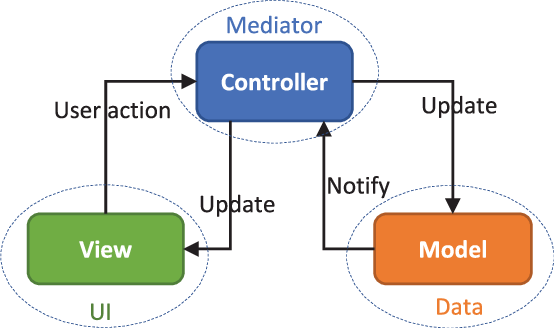

## MVC Design Pattern

**M = Model**   
**V = View**   
**C = Controller**  

তিনজন বন্ধু, যারা একসাথে কাজ করে একদম মিটিংয়ের মতো!
তিনজনেরই আলাদা আলাদা কাজ, কিন্তু সবাই মিলে বানায় দারুণ একটা ওয়েব অ্যাপ্লিকেশন।

---

### তিন বন্ধুর কাজ কী?

| বন্ধু          | কাজের ব্যাখ্যা                                                               |
| -------------- | ----------------------------------------------------------------------------------------- |
| **Model**      | আমি ডেটার মালিক! ডেটা কোথা থেকে আসবে, কোথায় যাবে আমি জানি। ডাটাবেজের মাস্টার        |
| **View**       | আমি তোমাদের দেখাই, সেজন্য সুন্দর সুন্দর পেজ বানাই! তোমার সামনে যা দেখবে, সেটা আমার কাজ |
| **Controller** | আমি মাঝখানে আরকেস্ট্রেটর! ইউজারের কমান্ড শুনি, Model আর View কে বলি কে কি করবে         |

---

### Example

ধরো তুমি একটা রেস্টুরেন্টে গেলা।

* **Model** = রান্নাঘর, যেখানে খাবার তৈরি হয়।
* **View** = ওয়েটার, যিনি তোমার টেবিল এ খাবার নিয়ে আসেন আর মেনু দেখান।
* **Controller** = অর্ডার নেওয়ার লোক, যিনি তোমার অর্ডার রান্নাঘরকে জানায় এবং ওয়েটারকে নির্দেশ দেন খাবার টেবিলে দিতে।

---

### Workflow

1. ইউজার (Client) ওয়েবসাইটে কিছু action নেয়, ধরো ফরমে নাম্বার লিখে submit করল।
2. **Controller** ওই request পায়, বুঝে Model কে বলে, “দাদা, ওই নাম্বারটা ডাটাবেজে ঢুকিয়ে দাও।”
3. **Model** কাজ শেষ করে বলে “হ্যাঁ ভাই, আমি ডাটাবেজে ডাটা ঢুকালাম।”
4. Controller তখন View কে বলে, “ওরে View, ভাই, একটা success মেসেজ দেখাও ইউজারকে।”
5. **View** সুন্দর করে সেই মেসেজ ইউজারের সামনে তুলে ধরে।

---

### সুবিধা কী?

* কোড organized থাকে, একটা জায়গায় শুধু ডেটার কাজ, অন্য জায়গায় শুধু UI, আর মাঝখানে controller!
* অনেক ডেভেলপার একসাথে কাজ করতে পারে- Model, View, Controller আলাদা আলাদা বানাতে পারো।
* কোন একটা অংশ পরিবর্তন করলে বাকি অংশে খুব কম প্রভাব পড়ে।

---

### সমস্যা?

* ছোটখাটো প্রজেক্টে একটু বেশি জটিল মনে হতে পারে।
* মাঝে মাঝে Controller গুলো অনেক বড় হয়ে যেতে পারে, তাই ভালো ডিজাইন দরকার।

---

### কেন MVC লাগে?

* কোডকে সহজে বুঝতে ও মেইনটেইন করতে।
* ডেভেলপারদের আলাদা আলাদা কাজ করার সুযোগ দিতে।
* UI (ইউজার ইন্টারফেস) আর লজিক সম্পূর্ণ আলাদা রাখতে।
* বড় প্রজেক্টে ঝামেলা কমাতে।

### কোথায় ব্যবহার হয়?

* ওয়েব অ্যাপ্লিকেশন (যেমন Node.js + Express.js, Laravel, ASP.NET MVC, Ruby on Rails)
* ডেস্কটপ অ্যাপ্লিকেশন (যেমন Java Swing, .NET WinForms)
* মোবাইল অ্যাপ্লিকেশন (যেমন Android এর কিছু অ্যাপ)
* যে কোনও জায়গায় যেখানে UI ও ব্যাকএন্ড আলাদা করা দরকার।

**MVC = দলবদ্ধ কাজ, যেখানে Model ডেটার সুরক্ষা করে, View দেখানোর জিনিস সামলায়, আর Controller সবাইকে একসাথে কাজ করায়।**