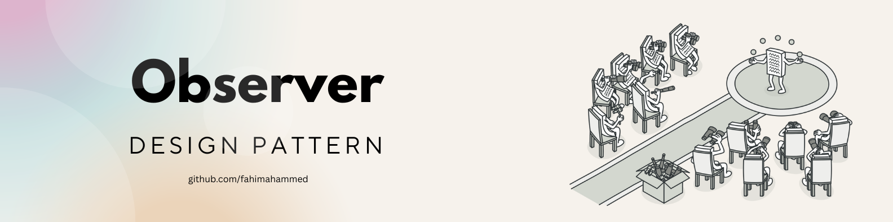
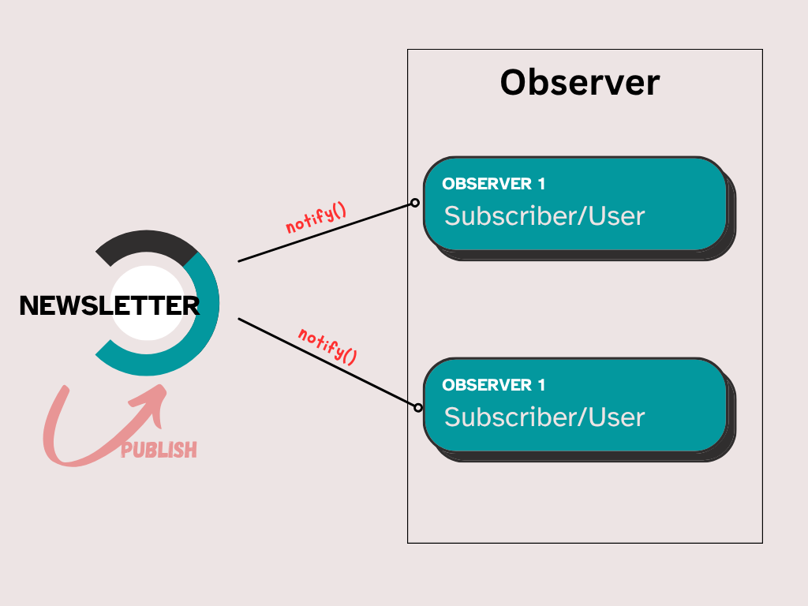

## Observer Pattern: শুনে শুনে কাজ করা! 

> “ঘন্টা বাজলেই স্কুল শেষ, notification এলেই ফেইসবুক খুলি — এই যে event শুনে action, এটাকেই বলে Observer Pattern!”

---

### কী এই Observer Pattern?

Observer Pattern হ'ল এক ধরণের **publish-subscribe** system, যেখানে একটা object (subject) কোনো change বা event ঘটালে, অন্য যারা তাকে observe করছে (observers), তারা সঙ্গে সঙ্গে জানে যায়।

> Subject = খবরের কাগজ
> Observer = সাবস্ক্রাইবার
> কেউ সাবস্ক্রাইব করলে, নতুন খবর এলেই পৌঁছে যায়!

---

### 🎯 Use case:

* Notification system 
* Email/newsletter subscription 
* Realtime UI updates (like stock ticker)
* Event-driven architecture 

---

### Example:

**Newsletter Subscription System**

Bow নামে একজন newsletter চালু করেছে।
যারা সাবস্ক্রাইব করে, তারা নতুন content পেলেই notification পায়।

> Bow যখন নতুন কনটেন্ট দেয়, তখন সে সব subscriber-দের জানিয়ে দেয়।

---

### কোড: (OOP version)

```js
// Subject (Publisher)
class Newsletter {
  constructor() {
    this.subscribers = [];
  }

  subscribe(user) {
    this.subscribers.push(user);
  }

  unsubscribe(user) {
    this.subscribers = this.subscribers.filter(sub => sub !== user);
  }

  publish(article) {
    console.log(`Bow just published: ${article}`);
    this.subscribers.forEach(sub => sub.notify(article));
  }
}

// Observer (Subscriber)
class User {
  constructor(name) {
    this.name = name;
  }

  notify(article) {
    console.log(`${this.name}, নতুন আর্টিকেল এসেছে: "${article}"`);
  }
}

// usage:
const newsletter = new Newsletter();

const user1 = new User("Fahim");
const user2 = new User("Shanto");

newsletter.subscribe(user1);
newsletter.subscribe(user2);

newsletter.publish("Design Patterns শেখা এখন সহজ!");
```

#### 🖥️ Output:

> Bow just published: Design Patterns শেখা এখন সহজ!

> Fahim, নতুন আর্টিকেল এসেছে: "Design Patterns শেখা এখন সহজ!"

> Shanto, নতুন আর্টিকেল এসেছে: "Design Patterns শেখা এখন সহজ!"




---

### তাহলে Main কথা:

* `Newsletter` হলো publisher (subject)
* `User` হলো subscriber (observer)
* Publisher জানে না কে কে সাবস্ক্রাইব করেছে — সে শুধু বলে "নতুন কিছু এসেছে"
* Subscriber নিজে জানে সে কীভাবে react করবে

---

### কখন ব্যবহার করবেন?

* যখন আপনি চান system parts গুলো loosely coupled হোক
* যখন একটার update হওয়াতে অনেকগুলা class/action ট্রিগার করতে হবে
* যখন event-driven logic চান

---

### Bonus: Functional style with Closure

```js
function createNewsletter() {
  const subscribers = [];

  return {
    subscribe: (fn) => subscribers.push(fn),
    publish: (article) => {
      console.log(`নতুন পাবলিকেশন: ${article}`);
      subscribers.forEach(fn => fn(article));
    }
  };
}

const newsletter = createNewsletter();

newsletter.subscribe((article) => console.log("সাবস্ক্রাইবার ১ পেল:", article));
newsletter.subscribe((article) => console.log("সাবস্ক্রাইবার ২ পেল:", article));

newsletter.publish("Observer Pattern মজাদার!");
```

---

### TL;DR

* **Observer Pattern** = event শুনে কাজ করা
* এটা **Publisher-Subscriber** system
* Loose coupling এবং realtime communication-এর জন্য দারুণ
* চমৎকার বাস্তব উদাহরণ: Notification, Chat app, Newsletter

