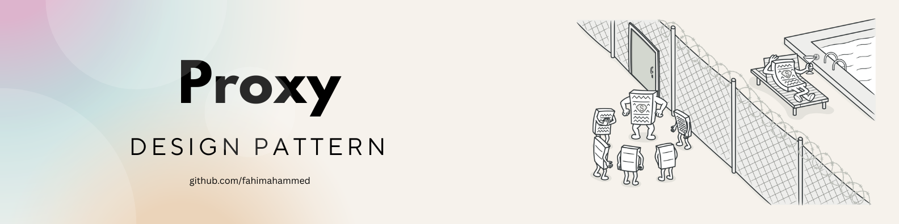
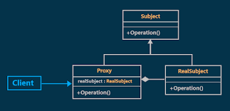

## Proxy Pattern: *"Main Boss-er আগেই একজন গেটকিপার!"*

### Proxy Pattern কী?

**Proxy Pattern** হচ্ছে এমন একটা Design Pattern, যেখানে আমরা কোনো Object-এর সাথে সরাসরি যোগাযোগ না করে, তার একজন **Proxy** বা **প্রতিনিধি** বা **গেটকিপার** দিয়ে কথা বলি।

অর্থাৎ, Object-এর সামনে একজন **Bodyguard** বসিয়ে দেই, যিনি ঠিক করবেন, কাকে দেখা যাবে, কাকে না, কে কী পরিবর্তন করতে পারবে, কে শুধুই দেখতে পারবে ইত্যাদি।

---

ধরো, তুমি একজন সেলিব্রিটি। তোমার নাম **"Fahim ভাই"**। এখন সবাই তোমার সাথে কথা বলতে চায়, কেউ তোমার নাম পাল্টাতে চায়, কেউ বয়স বাড়িয়ে দেয়, কেউ আবার বলে তুমি জাপানি!

তুমি তো বিরক্ত! তখনই তুমি একটা **Proxy** নিয়ে আসলে, সে হল তোমার **ম্যানেজার**। কেউ কিছু করতে চাইলে, আগে তার সাথে কথা বলতে হবে।

> নাম চেঞ্জ করতে চাও? *আগে ম্যানেজারের অনুমতি লাগবে!*   
> বয়স জানার ইচ্ছা? - *ম্যানেজার বলবে তুমি জানার যোগ্য কিনা!*

এই হলো Proxy Pattern - মূল object-এর সামনে এক প্রহরী!

---

## Code example:

```js
const fahim = {
  name: "Fahim",
  age: 18,
  nationality: "Bangladeshi"
};

const manager = new Proxy(fahim, {
  get: (obj, prop) => {
    if (!obj[prop]) {
      console.log(`${prop} বলতে কিছু নেই ভাই!`);
    } else {
      console.log(`${prop} হলো ${obj[prop]}`);
    }
  },
  set: (obj, prop, value) => {
    if (prop === "age" && typeof value !== "number") {
      console.log(`বয়সে নাম্বার না দিলে চলবে না!`);
    } else if (prop === "name" && value.length < 2) {
      console.log(`এই নামে কেউ থাকে নাকি ভাই?`);
    } else {
      console.log(`${prop} পাল্টানো হলো ${obj[prop]} থেকে ${value}`);
      obj[prop] = value;
    }
    return true;
  }
});

manager.name; // name হলো Fahim
manager.age = "forty"; // বয়সে নাম্বার না দিলে চলবে না!
manager.name = ""; // এই নামে কেউ থাকে নাকি ভাই?
manager.age = 20; // age পাল্টানো হলো 18 থেকে 20
```

---



এই ডায়াগ্রামে বুঝানো হয়েছে - সবকিছুর পেছনে আসল বস আছে, নাম তার `RealSubject`.

কিন্তু client সেই আসল Boss-এর কাছে সরাসরি যায় না।

- Client -> যায় Proxy-এর কাছে
- Proxy -> পরে গিয়ে কাজ করে `RealSubject` দিয়ে

**Proxy বলছে:**

> “তুমি কাজ চাও? আমি করে দিচ্ছি, কিন্তু আমার নিয়মে!”     
> “আসল বস এখন ব্যস্ত, আমি তার হয়ে কাজ করবো!”

Subject হল মূল Interface, যার মাধ্যমে Proxy আর RealSubject দুজনেই কাজ করে। সবাই মিলে একটা পরিবার, কিন্তু Proxy বাকি সবার Bodyguard.

---

### Real World Example:

তুমি কি কখনো **ফেসবুক প্রোফাইল** সেটিংসে গিয়েছো?

> তুমি নাম পাল্টাতে চাও - ফেসবুক বলে: "১২০ দিনের আগে চেঞ্জ করতে পারবা না ভাই!"    
> তুমি বয়স কমাতে চাও - ফেসবুক বলে: "তোমার বয়স তো অনেক বেড়ে গেছে!"    
> তুমি address দিতে চাও — ফেসবুক চেক করে দেয়!

ফেসবুকের এই চেকিং সিস্টেম গুলো আসলে একেকটা Proxy হিসেবে কাজ করে! ইউজার যা করতে চায়, তার আগেই Proxy যাচাই-বাছাই করে।

---

### আমরা কোথায় ব্যবহার করতে পারি?

1. **ডেটা Validation:** ইউজার ইনপুট যাচাই করার জন্য (যেমন নাম ফাঁকা নয়, বয়স নাম্বার হতে হবে)
2. **অ্যাক্সেস কন্ট্রোল:** কিছু property শুধু admin দেখতে পারবে - Proxy দিয়ে নিয়ন্ত্রণ সম্ভব
3. **Logging:** কে কখন কোন property দেখছে বা পরিবর্তন করছে তা track করার জন্য
4. **API Rate Limiting:** কেউ যেন ১ সেকেন্ডে ১০০ বার API না call করে - Proxy দিয়ে থামানো যায়!
5. **Virtual Loading:** ভারী object শুধু প্রয়োজন হলে লোড হবে - Proxy দিয়ে lazy load করা যায়

---

### ভালো-মন্দ:

#### ভালো দিক:

* নিয়ন্ত্রণ সহজ হয়
* validation/logging বাড়ে
* প্রোগ্রামের **বিশৃঙ্খলা কমে**

#### খারাপ দিক:

* সব জায়গায় ব্যবহার করলে পারফরম্যান্স খেয়ে ফেলে
* কোড জটিল হয়ে যেতে পারে
* নতুনদের জন্য একটু কনফিউজিং


> Proxy Pattern মানে হচ্ছে, **"মূল মানুষটার সামনে একজন স্মার্ট দারোয়ান"**।
> সে ঠিক করবে, কে কী করবে!

তাই, যখন তোমার system-এ কাউকে নিয়ন্ত্রণ করতে চাও, তখন Proxy Pattern তোমার **বিশ্বস্ত ম্যানেজার** হতে পারে!