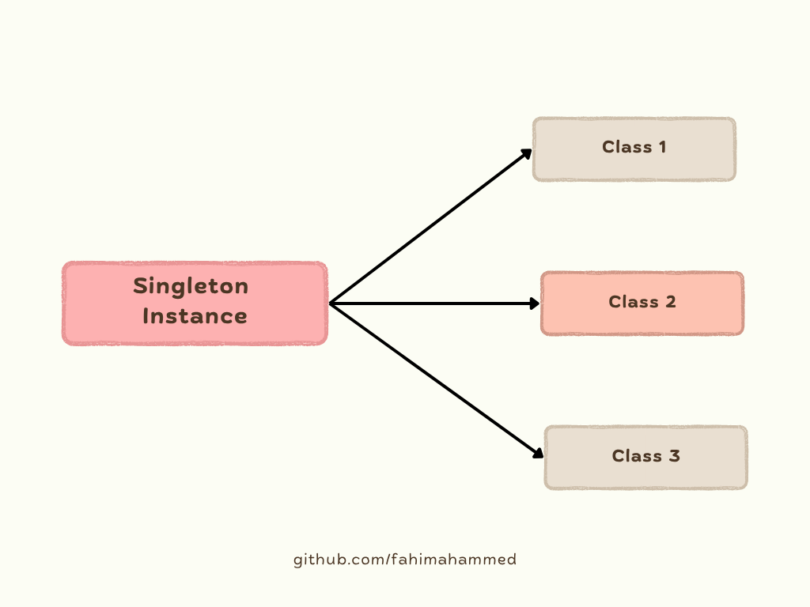

## Singleton Pattern: একটাই বউ, সারা জীবন কষ্ট!

**জীবনে যেমন একটা ভালো বউই যথেষ্ট, কোডেও তেমন একটা Singleton-ই যথেষ্ট!**

---

### Singleton মানে কী?

Simple ভাষায় - এমন একটা **class বা object** যেটা পুরো অ্যাপে **একটাই instance** থাকবে।
অর্থাৎ, একবার তৈরি হলে, নতুন করে আর কেউ বানাতে পারবে না, সবাইকে সেই পুরনোটাই দিয়ে কাজ চালাতে হবে!

> একবার বিয়ে করলে, আবার নতুন বৌ চাইলেই সমস্যা; পুরানোটাকেই রিসাইকেল করে চলতে হয়। ঠিক Singleton-ও তাই!



---

### চলুন, কোডে দেখি (JavaScript example):

```js
class Database {
  constructor() {
    if (Database.instance) {
      return Database.instance;
    }
    console.log("New Database Created!");
    Database.instance = this;
  }

  query(sql) {
    console.log(`Executing: ${sql}`);
  }
}

const db1 = new Database(); // New Database Created!
db1.query("SELECT * FROM users");

const db2 = new Database(); // আগেরটাই রিটার্ন হবে
db2.query("SELECT * FROM orders");

console.log(db1 === db2); // true 
```

---

### 🔍 এখানে কী হলো?

* আমরা দুইবার `new Database()` করেছি।
* কিন্তু সিস্টেমে আসলে **একটাই Database instance** তৈরি হয়েছে।
* দ্বিতীয়বার চাইলেও আগের ইনস্ট্যান্সটাই রিটার্ন হয়েছে।

---

### Singleton কখন ব্যবহার করবো?

যখন দরকার হয় **একটাই shared instance**, যেমন:

* Database connection
* Logger
* Configuration service
* Cache

---

### হালকা মজার analogy

> একবার instance হয়ে গেলে, আর `new` করলেও ওই **আগের বউ**-ই রিটার্ন করে!
> আর singleton-এ একটাই instance - সব জায়গায় সেটাই নিয়েই adjust করে নেয়।

---

### TL;DR

* Singleton Pattern: একটাই instance, সবাই মিলে use করে।
* বিয়ের মতো — একবার হয়ে গেলে, পালানোর উপায় নাই!